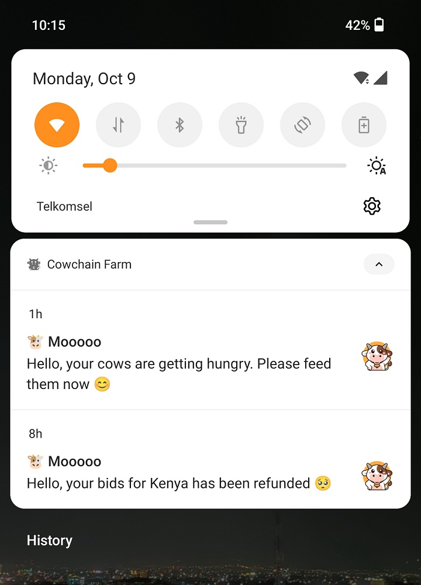
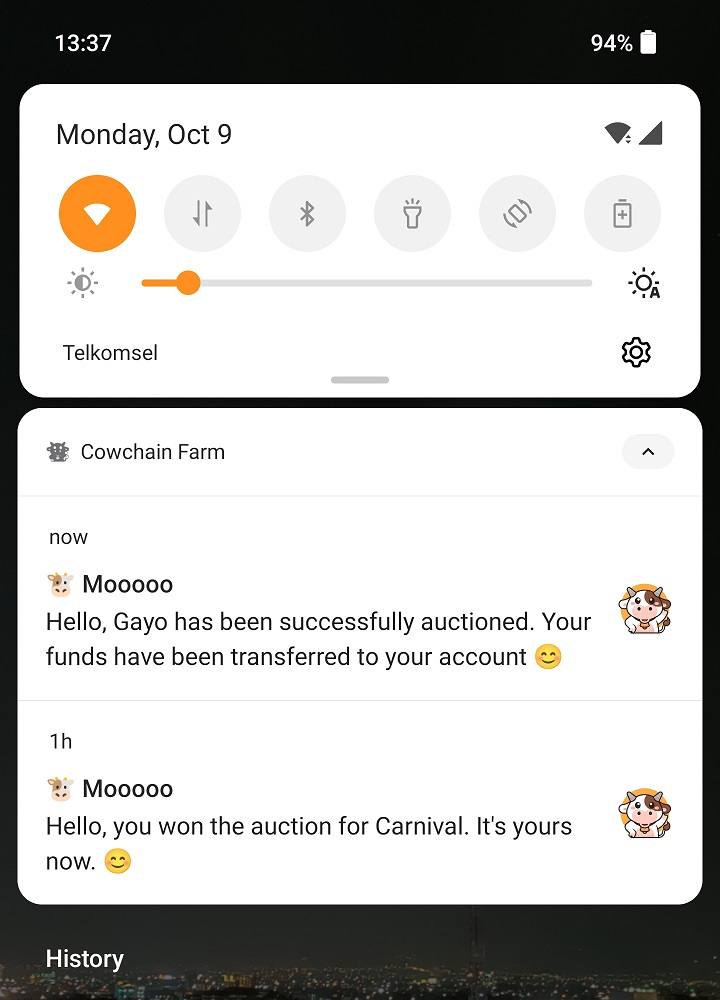

<br>
<div align="center">

<p align="center">Smart contract-based Cow Farming web app built with Flutter and Soroban</p>
</div>

## About Cowchain Farm

Cowchain Farm combines Rust-based smart contracts built with [Soroban](https://soroban.stellar.org) on Stellar
blockchain, and a web app client to
access the smart contracts functionality built with one of the most popular cross-platform
frameworks, [Flutter](https://flutter.dev).

Cowchain Farm smart contract will cover several capabilities of Soroban that exist in
the [Preview 11 release](https://soroban.stellar.org/docs/reference/releases), which include:

1. Authentication and authorization
2. Error handling
3. Custom types
4. Contract initialization
5. Contract upgrading
6. Payment transfer
7. Data storage expiration
8. Events

While the Cowchain Farm web app will cover the following:

1. Calling Soroban smart contract function using [Flutter Stellar SDK](https://pub.dev/packages/stellar_flutter_sdk)
2. Communication with the [Freighter](https://www.freighter.app) browser extension

And the latest addition is the Cowchain Farm notification service, which includes:

1. Ingesting events from Soroban smart contracts using [Dart CLI](https://dart.dev/tutorials/server/get-started) with [Flutter Stellar SDK](https://pub.dev/packages/stellar_flutter_sdk)
2. Sending notifications to Cowchain Farm users using [OneSignal](https://onesignal.com)

## Get Started

This article is specifically about the Flutter web app for Cowchain Farm.

Discussion for Cowchain Farm smart contract is in the [Cowchain Farm Soroban repository](https://github.com/hasToDev/cowchain-farm-soroban),
and the discussion for Cowchain Farm Dart CLI notification service is in the [Cowchain Farm Alert repository](https://github.com/hasToDev/cowchain-farm-alert).

The Cowchain Farm web app in this repository was developed using `Flutter version 3.13.5` and `Dart version 3.1.2`

## Clone, Run, Build, and Deploy

1. Clone the repository:
    ```shell
    git clone https://github.com/hasToDev/cowchain-farm-app.git
    ```

2. If you wish to deploy your own smart contract version, make sure to change the `Contract ADDRESS` in
   the [`cow_contract.dart`](lib/contracts/cow_contract.dart) file with the one you receive from the Soroban server during deployment.


3. Install all the project dependencies:
    ```dart
    flutter pub get
    ```
4. Run on local browser (**web-port** is optional between 0-65535):
    ```dart
    flutter run --web-renderer canvaskit -d web-server --web-port 45454
    ```
5. Generate the release build for Cowchain Farm Web app:
    ```dart
    flutter clean
    flutter pub get
    flutter build web --web-renderer canvaskit --release
    ```

6. You can follow the following articles to deploy the web app to GitHub pages:

    - [Simple way to deploy a Flutter Web Application on GitHub](https://flutterawesome.com/simple-way-to-deploy-a-flutter-web-application-on-github/)
    - [Publishing your Flutter apps into GitHub pages](https://dev.to/rodrigocastro_o/publishing-your-flutter-apps-into-github-pages-1l61)
    - *YouTube:* [Flutter Tutorial - Host Flutter Website On GitHub Pages](https://www.youtube.com/watch?v=z-yOqoQ2q6s)


7. You can follow the following articles to setup your OneSignal Flutter SDK:

   - [Flutter SDK Setup](https://documentation.onesignal.com/docs/flutter-sdk-setup)
   - [How to Add Push Notifications to a Flutter App](https://onesignal.com/blog/how-to-add-push-notifications-in-flutter-with-onesignal/)
   - *YouTube:* [OneSignal 101: Flutter SDK Setup](https://www.youtube.com/watch?v=5klspCULQe4)


8. Generate the release build for Cowchain Farm Mobile notification app:
    ```dart
    flutter clean
    flutter pub get
    flutter build apk --release
    ```  

## How to Play

Before playing Cowchain Farm, make sure you have a **Stellar TESTNET account**. You can create the account using
Stellar Laboratory [here](https://laboratory.stellar.org/#account-creator?network=test).
Also make sure you have enabled **Experimental Mode** in the Freighter browser extension.

1. Login to Cowchain Farm with your account using Freighter.
2. Buy your cow at the market using Stellar native asset (XLM).
3. When buying the cow, choose your Cow name wisely because the name is unique in Cowchain Farm. The cow gender will be assigned randomly by the smart contract. 
4. Feed cow every 6 hours intervals or equal to 4320 ledgers.<u>If you don't feed the cow within 24 hours, the cow will die.</u>
5. After your cow reaches 3 days of age or equal to 51840 ledgers, you can start selling it back to the market.
6. Of course, you can choose to keep feeding the cow. As the cow grows, the price increases (or decreases).
7. The feeding interval plays an essential role in increasing or decreasing your cow's value. As a rule, always feed your cow no more than 18 hours after its last meal.
8. An auction feature is now available. You can bid on someone's Cow at an auction, or you can auction your Cow at a much higher price than the market.

## Cow Feeding Guides

The cow's hunger level will increase every 6 hours. Here are the levels of cow hunger in Cowchain Farm every 4320
ledgers since its last feed:

1. **Full**, ledger *0 - 4320*
   <br>At this level, you don't need to feed the cow.<br><br>
2. **Hungry**, ledger *4320 - 8640*
   <br>The cow feels a little hungry, and this is the optimal time to feed the cow.<br> Feeding at this level will
   increase cow's price by <span style="color:green">0.5%</span>.<br><br>
3. **Peckish**, ledger *8640 - 12960*
   <br>Cow hunger grows; feed the cow right now to keep it healthy.<br>Feeding at this level will increase cow's price
   by <span style="color:green">0.25%</span>.<br><br>
4. **Famished**, ledger *12960 - 17280*
   <br>Cow hungers at its peak feed the cow immediately.<br>Feeding at this level will decrease cow's price
   by <span style="color:red">1%</span>, but the cow will live to see another day.

## Cow Selling Guides

The cows that we have will be able to be sold after they are 3 days old, or the equivalent of 51840 ledgers.

If you try to sell a cow that is still underage, Cowchain Farm contract will not execute the sale and will only provide
certain information.

Before executing the sale, Cowchain Farm contract will evaluate the cow price and ask you to confirm the selling price.

## Auction Guides

Auction is a new feature for the TESTNET version of Cowchain Farm.

Once initiated, an auction will last for 8640 ledgers or approximately 12 hours. There are no limitations for auction, you can start auctioning cows that you just bought from the market.

But be aware every auction and every bid is final. You cannot cancel any auction or bid that you have done.

Once the auction has reached the time limit, you can claim the auction result manually on the auction page, or the notification service will do it for you.

## Notification App

<br>
<div align="center">

&nbsp;&nbsp;

</div>
<br>

A new notification app is now available for the TESTNET version of Cowchain Farm.

You will now be notified if you install the app and register your Account ID or Public Key of your Stellar TESTNET account in the app.

The Cowchain Farm notification service will send notifications when:

1. Your cow starts to feel hungry.
2. You win an auction.
3. Your funds are refunded because someone outbid you at an auction.

There are 2 ways you can install the app:

1. Clone this repository, build the Android APK, and install directly to your phone.
2. Download the prebuilt Android APK at [this DropBox link](https://www.dropbox.com/scl/fi/q6qksqguoi30dgfo3t5c2/cowchain_farm_200.apk?rlkey=7n0xadf3j6r01hp65jxsdo0fo&raw=1).

Due to some development limitations, for now the app is only available on Android.

## License

The Cowchain Farm is distributed under an MIT license. See the [LICENSE](LICENSE) for more information.

[](https://opensource.org/licenses/MIT)

## Contact

[Hasto](https://github.com/hasToDev) - [@HasToDev](https://twitter.com/HasToDev)
